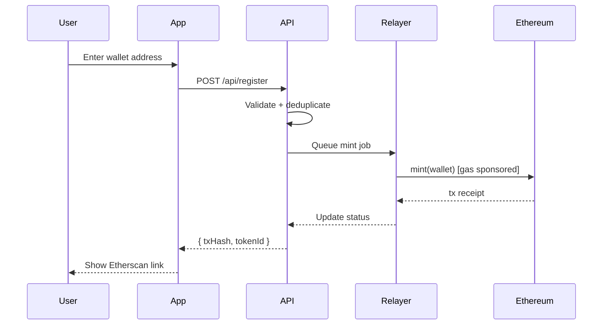
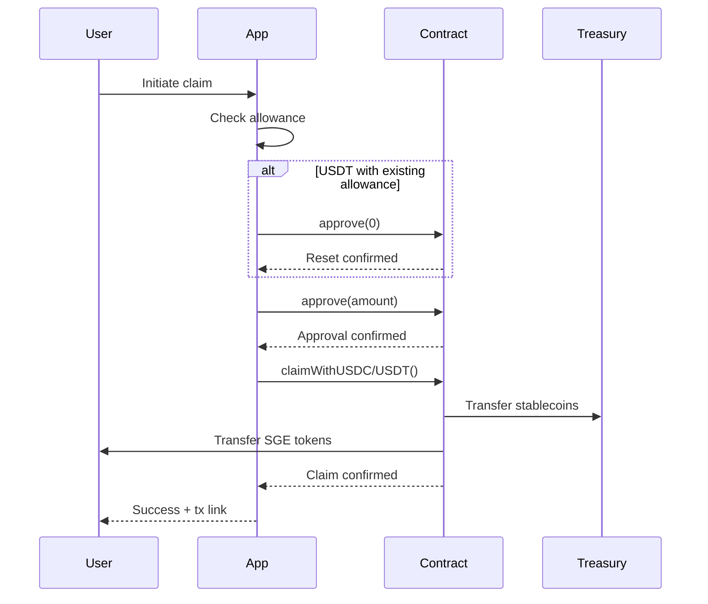

<div align="center">

# ⚡ SGE Energy Platform

### Enterprise Ethereum Settlement Infrastructure

**Gasless NFT Identity • Stablecoin Claims • Multi-Tenant Affiliate Network**

[](https://ethereum.org)
[](https://www.typescriptlang.org/)
[](https://react.dev/)
[](./LICENSES.md)

<br />

[**🌐 Live Demo**](https://unykornai.github.io/sge/app/) &nbsp;•&nbsp; [**📖 Documentation**](https://unykornai.github.io/sge/) &nbsp;•&nbsp; [**📊 Status**](https://unykornai.github.io/sge/app/#/status)

<br />


</div>

---

## Overview

SGE Energy is a production-grade Ethereum mainnet settlement platform enabling:

- **Gasless NFT Identity (SGE-ID)** — Users receive ERC-721 identity tokens at zero gas cost via relayer sponsorship
- **Stablecoin Claims** — USDC/USDT → SGE token conversion with proper USDT allowance reset handling
- **Multi-Tenant Architecture** — Isolated affiliate programs with dedicated treasuries and commission structures
- **Double-Entry Ledger** — Perfect settlement guarantees with cryptographic audit trails

> ⚠️ **Production System**: This platform handles real value on Ethereum mainnet. Review [disclosures](https://unykornai.github.io/sge/disclosures.html) before deployment.

---

## Quick Start

### Prerequisites

| Requirement | Version | Purpose |
|-------------|---------|---------|
| Node.js | 18+ | Runtime |
| npm | 9+ | Package manager |
| Docker | Latest | Production mode |
| Ethereum RPC | Mainnet | Alchemy/Infura |

### 30-Second Setup (Mock Mode)

```bash
git clone https://github.com/unykornai/sge.git
cd sge
npm run setup
npm run dev
```

**That's it.** Open http://localhost:5173 — full system running in-memory.

### Production Setup

```bash
# 1. Generate wallets
npm run wallet:new

# 2. Configure environment
cp packages/api/.env.example packages/api/.env
# Edit with RPC URL, wallet keys, contract addresses

# 3. Deploy contracts (requires funded deployer)
cd packages/contracts && npm run deploy:mainnet

# 4. Fund relayer
# Send 0.05-0.1 ETH to RELAYER_ADDRESS

# 5. Start production stack
docker-compose up -d
```

---

## Architecture

```
┌─────────────────────────────────────────────────────────────────────────────┐
│                              SGE Energy Platform                             │
├─────────────────────────────────────────────────────────────────────────────┤
│                                                                             │
│  ┌─────────────┐    ┌─────────────┐    ┌─────────────┐    ┌─────────────┐  │
│  │   React     │    │   Express   │    │  Postgres   │    │  Ethereum   │  │
│  │   PWA       │◄──►│   API       │◄──►│  + Redis    │    │  Mainnet    │  │
│  │   (Vite)    │    │   (Node)    │    │             │    │             │  │
│  └─────────────┘    └──────┬──────┘    └─────────────┘    └──────▲──────┘  │
│                            │                                     │         │
│                            ▼                                     │         │
│                    ┌───────────────┐                             │         │
│                    │   Relayer     │─────────────────────────────┘         │
│                    │   (Gas Sponsor)                                       │
│                    └───────────────┘                                       │
│                                                                             │
└─────────────────────────────────────────────────────────────────────────────┘
```

### Core Components

| Package | Description | Technology |
|---------|-------------|------------|
| `@sge/app` | Mobile-first PWA with Coinbase Wallet integration | React 18, Vite, wagmi |
| `@sge/api` | RESTful API with idempotency and rate limiting | Express, Prisma, Zod |
| `@sge/contracts` | ERC-721 identity + ERC-20 claim contracts | Hardhat, Solidity 0.8.23 |
| `@sge/relayer` | Background job processor for gasless minting | BullMQ, ethers.js |
| `@sge/shared` | ABIs, addresses, types, utilities | TypeScript |

### Operating Modes

| Mode | Database | Blockchain | Use Case |
|:----:|:--------:|:----------:|----------|
| **Mock** | In-memory | Simulated | Development, demos |
| **Real** | Postgres | Mainnet RPC | Staging, production |
| **Pages** | MSW | MSW | GitHub Pages demo |

---

## User Flows

### Registration (Gasless NFT Mint)



### Claim (USDC/USDT → SGE)



---

## API Reference

### Public Endpoints

| Method | Endpoint | Description |
|--------|----------|-------------|
| `POST` | `/api/register` | Gasless SGE-ID mint (idempotent) |
| `GET` | `/api/status?wallet=0x...` | Registration/payment/claim status |
| `GET` | `/healthz` | System health check |

### Claim Endpoints

| Method | Endpoint | Description |
|--------|----------|-------------|
| `GET` | `/api/claim/info?wallet=0x...` | Eligibility + allowance status |
| `POST` | `/api/claim/prepare` | Transaction preparation steps |
| `POST` | `/api/claim/record` | Record completed claim |

### Admin Endpoints (requires `X-Admin-Key`)

| Method | Endpoint | Description |
|--------|----------|-------------|
| `GET` | `/api/admin/stats` | Platform statistics |
| `GET` | `/api/admin/fund-check` | Relayer balance status |
| `POST` | `/api/admin/payment/manual` | Manual payment entry |

---

## Contract Addresses (Mainnet)

| Contract | Address | Etherscan |
|----------|---------|-----------|
| **SGE Token** | `0x40489719E489782959486A04B765E1E93E5B221a` | [View](https://etherscan.io/address/0x40489719E489782959486A04B765E1E93E5B221a) |
| **SGE Claim** | `0x4BFeF695a5f85a65E1Aa6015439f317494477D09` | [View](https://etherscan.io/address/0x4BFeF695a5f85a65E1Aa6015439f317494477D09) |
| **USDC** | `0xA0b86991c6218b36c1d19D4a2e9Eb0cE3606eB48` | [View](https://etherscan.io/address/0xA0b86991c6218b36c1d19D4a2e9Eb0cE3606eB48) |
| **USDT** | `0xdAC17F958D2ee523a2206206994597C13D831ec7` | [View](https://etherscan.io/address/0xdAC17F958D2ee523a2206206994597C13D831ec7) |

---

## Security

### Implemented Controls

- **HMAC-SHA256** — Webhook signature verification with timing-safe comparison
- **Helmet** — Security headers (CSP/COEP optimized for wallet compatibility)
- **Rate Limiting** — Tiered limits (5/hr register, 60/hr claims)
- **Idempotency** — Prevents duplicate settlements via request keys
- **Zod Validation** — Runtime schema validation on all inputs
- **Chain Guard** — Client + server enforcement of chainId = 1

### Audit Checklist

- [ ] Review [Trust Boundaries](https://unykornai.github.io/sge/diagrams/trust-boundaries.html)
- [ ] Review [Threat Model](https://unykornai.github.io/sge/ops/threat-model.html)
- [ ] Verify contract ownership and access controls
- [ ] Confirm relayer wallet is properly funded
- [ ] Test webhook signature validation

---

## Observability

### Prometheus Metrics

```bash
curl http://localhost:3000/metrics
```

Available metrics:
- `sge_registrations_total` — Total mint requests
- `sge_claims_total` — Total claim completions
- `sge_relayer_balance_eth` — Current relayer ETH balance
- `sge_http_requests_total` — Request counts by endpoint

### OpenTelemetry (Optional)

```bash
OTEL_ENABLED=true \
OTEL_SERVICE_NAME=sge-api \
OTEL_EXPORTER_OTLP_ENDPOINT=http://localhost:4318 \
npm run dev
```

---

## Testing

```bash
# Unit + integration tests
npm test

# TypeScript type checking
npm run test:ci

# Load testing (k6)
cd ops/k6 && k6 run register.js

# Contract tests
npm run test:contracts
```

---

## Deployment

### Docker Compose

```bash
docker-compose up -d
docker-compose logs -f
```

### PM2

```bash
npm run build
pm2 start ecosystem.config.js
pm2 monit
```

### GitHub Pages (Demo)

The demo automatically deploys on push to `main`:

**Live URL**: https://unykornai.github.io/sge/app/

---

## Environment Variables

### API (`packages/api/.env`)

```env
# Server
PORT=3000
HOST=0.0.0.0
APP_ORIGIN=http://localhost:5173
ADMIN_API_KEY=change-in-production

# Ethereum
ETH_RPC_HTTPS=https://eth-mainnet.g.alchemy.com/v2/YOUR_KEY
MOCK_MODE=false

# Wallets (generate with: npm run wallet:new)
DEPLOYER_ADDRESS=0x...
DEPLOYER_PRIVATE_KEY=0x...
RELAYER_ADDRESS=0x...
RELAYER_PRIVATE_KEY=0x...

# Contracts
SGEID_ADDRESS=0x...
SGE_TOKEN=0x40489719E489782959486A04B765E1E93E5B221a
SGE_CLAIM=0x4BFeF695a5f85a65E1Aa6015439f317494477D09

# Relayer Thresholds
RELAYER_WARN_THRESHOLD_ETH=0.05
RELAYER_CRITICAL_THRESHOLD_ETH=0.01
RELAYER_HALT_THRESHOLD_ETH=0.005

# Optional: Alerting
ALERT_WEBHOOK_URL=https://hooks.slack.com/...
```

### App (`packages/app/.env.local`)

```env
VITE_ETH_RPC_HTTPS=https://eth-mainnet.g.alchemy.com/v2/YOUR_KEY
VITE_SGE_TOKEN=0x40489719E489782959486A04B765E1E93E5B221a
VITE_SGE_CLAIM=0x4BFeF695a5f85a65E1Aa6015439f317494477D09
VITE_FEE_USD=100
```

---

## Compliance

| Requirement | Implementation |
|-------------|----------------|
| **KYC Gate** | Configurable via `KYC_REQUIRED` |
| **36-Month Vesting** | Full disclosure in UI and docs |
| **Risk Warnings** | Market volatility disclosures |
| **Age Restriction** | 18+ verification support |
| **Data Privacy** | No PII on-chain |

**Required reading**: [Disclosures](https://unykornai.github.io/sge/disclosures.html) • [Privacy](https://unykornai.github.io/sge/privacy.html)

---

## Repository Structure

```
sge/
├── packages/
│   ├── api/          # Express REST API
│   ├── app/          # React PWA (Vite)
│   ├── contracts/    # Solidity + Hardhat
│   ├── relayer/      # Background job processor
│   └── shared/       # ABIs, types, utilities
├── docs/             # VitePress documentation
├── ops/
│   └── k6/           # Load test scripts
├── scripts/          # Setup and utility scripts
├── docker-compose.yml
├── ecosystem.config.js
└── package.json
```

---

## Contributing

1. Read [CONTRIBUTING.md](./CONTRIBUTING.md) and [CODE_OF_CONDUCT.md](./CODE_OF_CONDUCT.md)
2. Check [STATUS.md](./STATUS.md) for project state
3. All commits must include DCO sign-off: `git commit -s -m "feat: ..."`

---

## License

Dual-licensed under [MIT](./LICENSE-MIT) or [Apache-2.0](./LICENSE-APACHE) at your option.

Code license does not grant rights to "SGE" or "SGE Energy" trademarks. See [TRADEMARKS.md](./TRADEMARKS.md).

---

<div align="center">

**[Documentation](https://unykornai.github.io/sge/)** • **[Demo](https://unykornai.github.io/sge/demo/)** • **[Issues](https://github.com/unykornai/sge/issues)**

<sub>Built with ⚡ for Ethereum Mainnet</sub>

</div>
