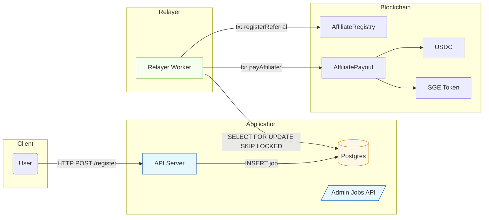
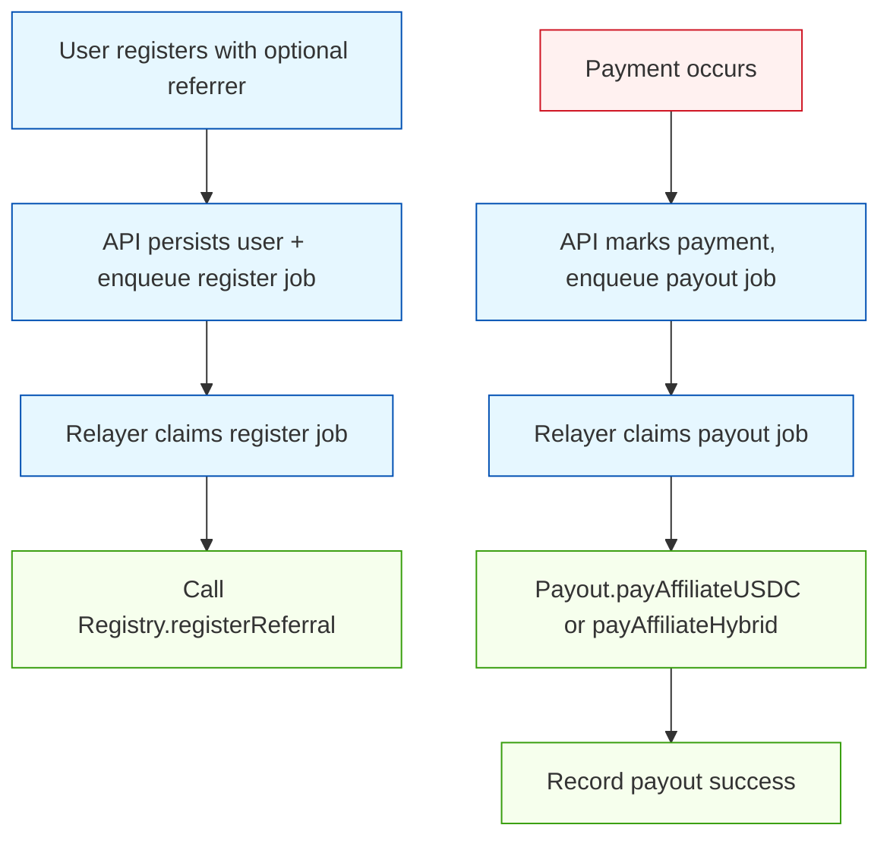
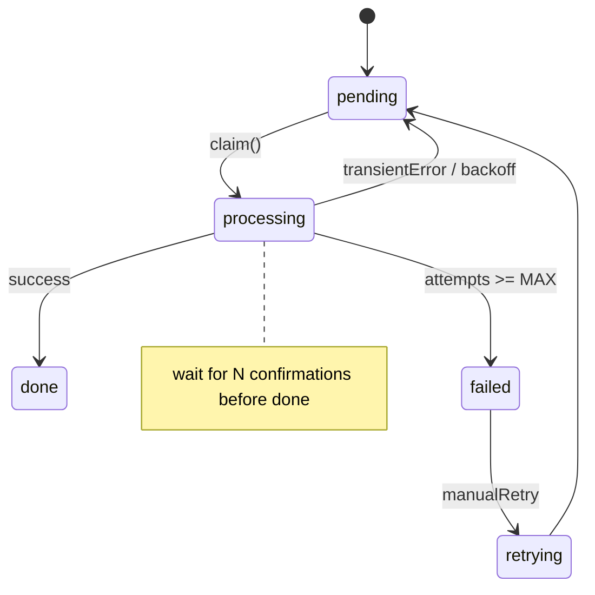

 # Senior Engineering Architecture — Professional Overview

Table of Contents
- [Executive Summary](#executive-summary)
- [System Components](#system-components)
- [Diagrams](#diagrams)
  - [SR Sequence Diagram](#sr-sequence-diagram)
  - [Component Topology](#component-topology)
  - [Flowchart: Register → Payout](#flowchart-register--payout)
  - [Flow Model: Reliability & Retry](#flow-model-reliability--retry)
- [Operational Concerns](#operational-concerns)
- [Security & Hardening](#security--hardening)
- [Runbook & Deployment](#runbook--deployment)
- [Appendix: Migration & Scripts](#appendix-migration--scripts)

---

## Executive Summary

This document presents a senior‑level, professional architecture view of the Affiliate Instant Liquidity system and its off‑chain relayer. It includes color‑coded diagrams, flowcharts, and operational guidance intended for engineering leads and operators.

Recommendations
- Use Postgres/Redis for durable, atomic queues.
- Run the relayer in a small fleet with leader election or DB claim semantics.
- Store keys in a vault and use monitoring/alerts for contract balances.

---

## System Components

- API Server — handles registration and payment webhooks; enqueues jobs.
- Relayer — off‑chain worker that claims jobs, signs, and submits on‑chain transactions.
- Postgres — durable job queue (`jobs` table) with atomic claiming.
- Smart Contracts — `AffiliateRegistry`, `AffiliatePayout`, and token contracts.
- Monitoring — metrics, logs, and alerting for failures and low balances.

---

## Diagrams

Diagrams are embedded below as Mermaid; use an MD viewer that supports Mermaid rendering.

### SR Sequence Diagram
- See [docs/diagrams/sr-sequence.md](docs/diagrams/sr-sequence.md#L1) for the SR-level sequence.

### Component Topology

### Flowchart: Register → Payout

### Flow Model: Reliability & Retry (State Transition)

---

## Operational Concerns

- Monitoring: jobs processed/min, failures, average attempts, relayer nonce errors, contract balances.
- Scaling: run multiple relayer replicas; use `SELECT ... FOR UPDATE SKIP LOCKED` to avoid duplicates.
- Recovery: dead‑letter failed jobs; provide manual retry endpoints.

---

## Security & Hardening

- Store `RELAYER_PRIVATE_KEY` in a vault; rotate periodically.
- On-chain: restrict relayer functions to a role; add `Pausable` and `Ownable` guards.
- Limit payouts per time window to prevent abuse.

---

## Runbook & Deployment

1. Apply DB migration: `packages/relayer/migrations/001_create_jobs.sql`.
2. Deploy contracts and set `AFFILIATE_REGISTRY_ADDRESS` and `AFFILIATE_PAYOUT_ADDRESS`.
3. Fund `AffiliatePayout` with USDC and grant token approvals.
4. Configure `DATABASE_URL`, `RELAYER_PRIVATE_KEY`, `ETH_RPC_HTTPS` and start services.

---

## Appendix: Migration & Scripts

- Relayer migration runner: `packages/relayer/src/migrate.ts`.
- Admin job endpoints: `GET /api/jobs`, `POST /api/jobs/retry/:id`, `DELETE /api/jobs/:id`.
