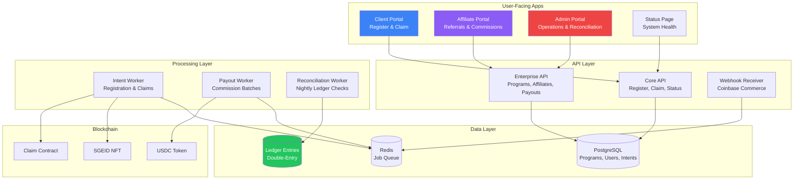
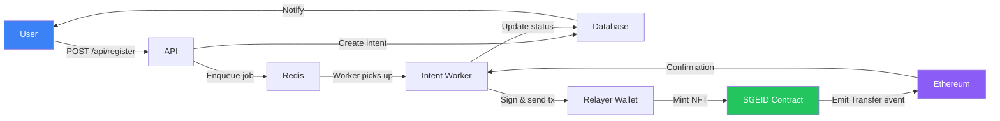
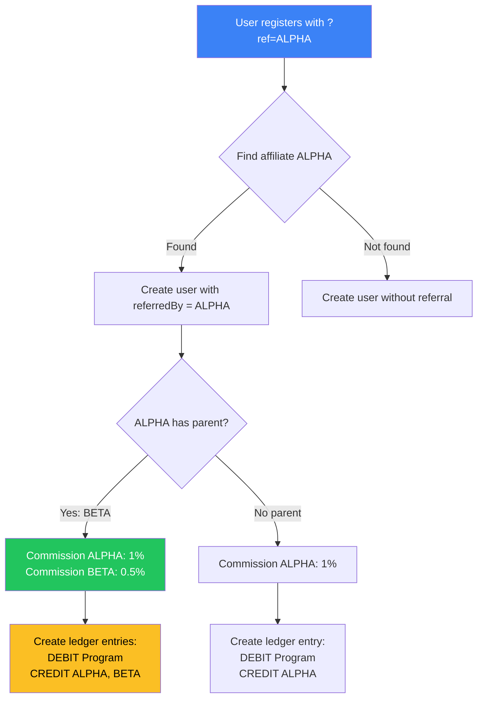

# Platform Overview

Complete visual guide to the SGE multi-tenant settlement platform.

---

## What is SGE?

**SGE (Sustainable Green Energy)** is a multi-tenant settlement platform for managing token distributions with perfect settlement guarantees.

### Core Value Propositions

**For End Users:**
- ✅ **Gasless registration**: Receive SGE-ID NFT without paying gas
- ✅ **Simple claims**: One-click token redemption
- ✅ **Transparent tracking**: Real-time status of settlements
- ✅ **Mobile-first**: Optimized for Coinbase Wallet

**For Programs (Clients):**
- ✅ **Multi-tenant isolation**: Dedicated treasury and ledger
- ✅ **Affiliate networks**: Built-in referral system with commission splits
- ✅ **Perfect accounting**: Double-entry ledger with reconciliation
- ✅ **Operational visibility**: Real-time dashboards and alerts

**For Affiliates:**
- ✅ **Tree attribution**: Earn commissions on sub-affiliate referrals
- ✅ **Automated payouts**: Monthly batch payments with approval workflow
- ✅ **Tracking portal**: View referrals, commissions, and earnings

---

## Platform Components



---

## User Flows

### 1. Client Registration

**Step 1**: User connects wallet
**Step 2**: Clicks "Register" (no payment yet)
**Step 3**: Relayer mints SGE-ID NFT
**Step 4**: User receives NFT (tokenId = sequential)

**Result**: User is registered in system, ready to claim

---

### 2. Token Claim

**Step 1**: User has USDC/USDT in wallet
**Step 2**: Clicks "Claim 100 SGE"
**Step 3**: Approves USDC transfer (if needed)
**Step 4**: Claim contract transfers USDC from user to treasury
**Step 5**: SGE tokens distributed per vesting schedule

**Result**: User receives SGE tokens, treasury receives USDC

---

### 3. Affiliate Referral

**Step 1**: Affiliate shares link: `app.yourdomain.com/?ref=ALPHA`
**Step 2**: User registers via link
**Step 3**: System records referral attribution
**Step 4**: Commission accrued to ALPHA (1% of $10 = $0.10)
**Step 5**: If ALPHA was referred by BETA, BETA earns tier-2 commission (0.5%)

**Result**: Commissions flow up the affiliate tree

---

### 4. Payout Cycle

**Step 1**: Daily job finds ACCRUED commissions > 30 days old
**Step 2**: Updates status to PAYABLE
**Step 3**: Creates payout batch (PENDING_APPROVAL)
**Step 4**: Admin reviews and approves batch
**Step 5**: Worker executes multi-send transaction
**Step 6**: Updates commissions to PAID

**Result**: Affiliates receive their earnings monthly

---

## Data Flow

### Registration Pipeline



### Commission Attribution



---

## Technology Stack

### Frontend
- **Framework**: React 18 + TypeScript
- **Build**: Vite 5
- **Styling**: Tailwind CSS + Custom design system
- **Charts**: Recharts
- **Wallet**: Wagmi + WalletConnect + Coinbase SDK
- **Demo**: MSW (Mock Service Worker)

### Backend
- **Runtime**: Node.js 18+ + Express
- **Language**: TypeScript
- **Database**: Prisma ORM + PostgreSQL 14+
- **Queue**: BullMQ + Redis 7+
- **Logging**: Pino (structured JSON)
- **Validation**: Zod

### Blockchain
- **Network**: Ethereum Mainnet (chainId = 1)
- **Contracts**: Solidity 0.8.23 + Hardhat
- **Libraries**: Ethers.js v6
- **Standards**: ERC-721 (SGEID), ERC-20 (tokens)

### DevOps
- **CI/CD**: GitHub Actions
- **Deployment**: PM2 or Docker Compose
- **Monitoring**: Prometheus + Grafana
- **Docs**: VitePress

---

## Operating Modes Comparison

| Feature | Pages Demo | Local Mock | Local Real | Production |
|---------|-----------|------------|------------|------------|
| **Setup time** | 0 sec (visit URL) | 30 sec | 5 min | Hours |
| **External services** | None | None | Postgres + Redis + RPC | Full stack |
| **Data persistence** | None | None (in-memory) | ✅ Database | ✅ Database |
| **Real blockchain** | ❌ Simulated | ❌ Mock provider | ✅ Mainnet RPC | ✅ Mainnet RPC |
| **Cost** | Free (GitHub Pages) | Free | ~$50/mo | ~$250/mo+ |
| **Use case** | Investor demos | Development | Testing | Live users |
| **Security risk** | None | None | Medium (test funds) | High (real money) |

---

## Key Metrics

### User Metrics
- **Total registrations**: Tracked in database
- **Total claims**: Tracked with settlement records
- **Active affiliates**: Count of affiliates with status=ACTIVE
- **Commission paid**: Sum of all PAID commissions

### System Metrics
- **Intent success rate**: Percentage of CONFIRMED vs total
- **Settlement latency**: Time from intent creation to confirmation
- **Queue depth**: Number of pending jobs
- **Relayer balance**: ETH remaining for gas sponsorship

### Financial Metrics
- **Ledger balance**: Must always equal zero (debits = credits)
- **Pending payouts**: Total PAYABLE commissions awaiting approval
- **Treasury balance**: USDC/USDT held in program treasuries
- **Gas costs**: Total ETH spent by relayer

---

## Security Model

### Wallet Separation

| Wallet | Type | Balance | Purpose |
|--------|------|---------|---------|
| **Deployer** | Cold (offline) | 0 ETH | Deploy contracts (one-time) |
| **Relayer** | Hot (server) | 0.2-0.5 ETH | Gas sponsorship |
| **Treasury** | Cold (multi-sig) | Unlimited | Receive user payments |

### Access Control

| Role | Permissions | Authentication |
|------|------------|----------------|
| **Client** | Register, claim, view status | Wallet signature |
| **Affiliate** | View referrals, track commissions | API key or wallet |
| **Admin** | Approve payouts, reconciliation | X-Admin-Key header |
| **System** | Background processing | Internal only |

### Attack Mitigation

| Vector | Defense |
|--------|---------|
| **Sybil attacks** | One NFT per wallet |
| **Duplicate claims** | Idempotency keys |
| **Replay attacks** | Webhook signature verification |
| **SQL injection** | Prisma ORM (parameterized queries) |
| **XSS** | React auto-escaping + CSP headers |
| **Rate limit bypass** | IP-based throttling |

---

## Troubleshooting

### "Database connection failed"
```bash
# Check if Postgres is running:
docker ps | grep postgres

# View logs:
npm run db:logs

# Reset database:
npm run db:reset
```

### "Relayer out of gas"
```bash
# Check balance:
curl http://localhost:3000/api/admin/funds

# Fund wallet:
# Send 0.5 ETH to relayer address shown in .env
```

### "Webhook signature invalid"
```bash
# Verify shared secret matches Coinbase Commerce settings
# Check COINBASE_COMMERCE_SHARED_SECRET in .env
```

### "Stuck intents"
```bash
# View stuck intents:
curl http://localhost:3000/api/admin/reconciliation

# Manual retry:
curl -X POST http://localhost:3000/api/admin/reconciliation/retry/{intentId}
```

---

## Resources

- **Architecture Diagrams**: [architecture/workflows.md](architecture/workflows.html)
- **API Reference**: [architecture/enterprise.md](architecture/enterprise.html)
- **Operations**: [ops/reconciliation.md](ops/reconciliation.html)
- **Security**: [ops/threat-model.md](ops/threat-model.html)
