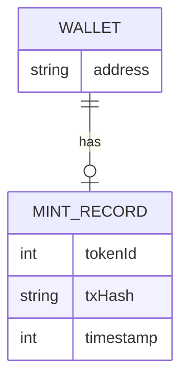

# Data & Storage

## Storage model

The API stores small operational records (e.g., mint records, claims) in a JSON persistence layer.

## Notes

- For production scale, migrate JSON persistence to Postgres.
- Keep PII minimal; prefer wallet address identifiers.
