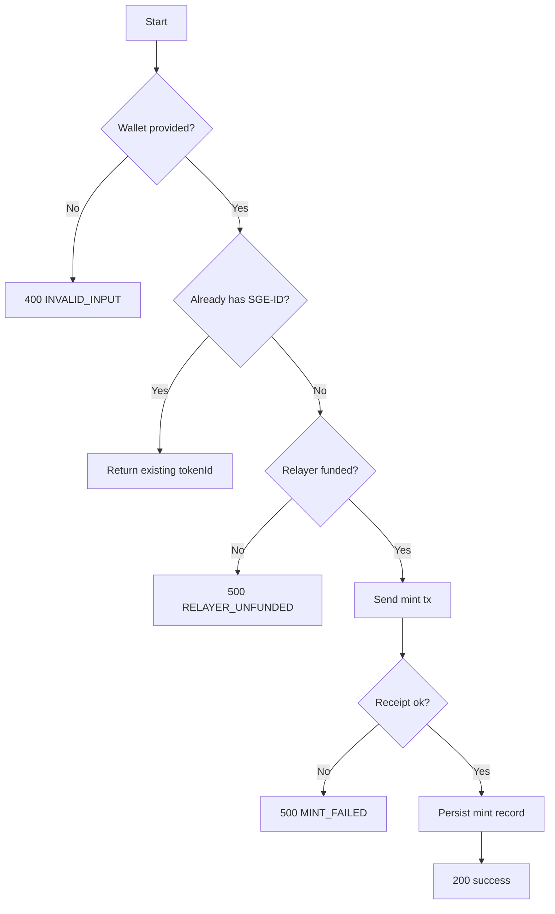
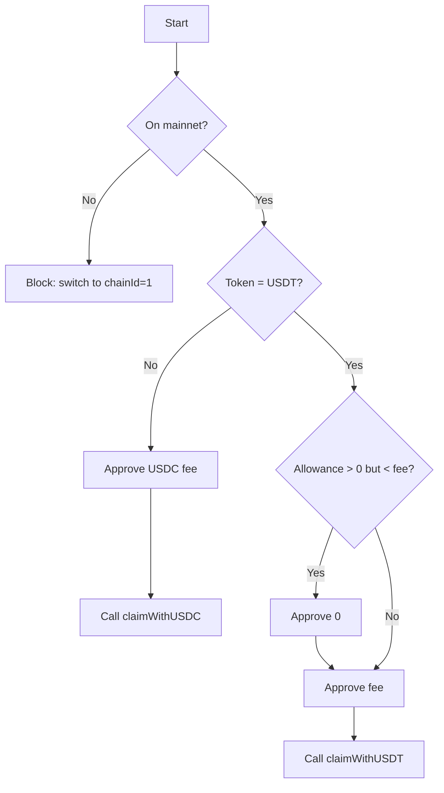
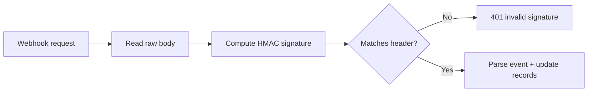

# Flow Trees

This page contains “flow trees” and decision diagrams (Mermaid) for common paths.

## Register (gasless SGE‑ID)

```mermaid
flowchart TD
  A[Start] --> B{Wallet provided?}
  B -- No --> X[400 INVALID_INPUT]
  B -- Yes --> C{Already has SGE-ID?}
  C -- Yes --> Y[Return existing tokenId]
  C -- No --> D{Relayer funded?}
  D -- No --> Z[500 RELAYER_UNFUNDED]
  D -- Yes --> E[Send mint tx]
  E --> F{Receipt ok?}
  F -- No --> G[500 MINT_FAILED]
  F -- Yes --> H[Persist mint record]
  H --> I[200 success]
```

## Claim (USDC/USDT)

```mermaid
flowchart TD
  A[Start] --> B{On mainnet?}
  B -- No --> X[Block: switch to chainId=1]
  B -- Yes --> C{Token = USDT?}
  C -- No --> D[Approve USDC fee]
  C -- Yes --> E{Allowance > 0 but < fee?}
  E -- Yes --> F[Approve 0]
  F --> G[Approve fee]
  E -- No --> G[Approve fee]
  D --> H[Call claimWithUSDC]
  G --> I[Call claimWithUSDT]
```

## Coinbase Commerce webhook verification

```mermaid
flowchart LR
  W[Webhook request] --> R[Read raw body]
  R --> S[Compute HMAC signature]
  S --> V{Matches header?}
  V -- No --> X[401 invalid signature]
  V -- Yes --> P[Parse event + update records]
```
