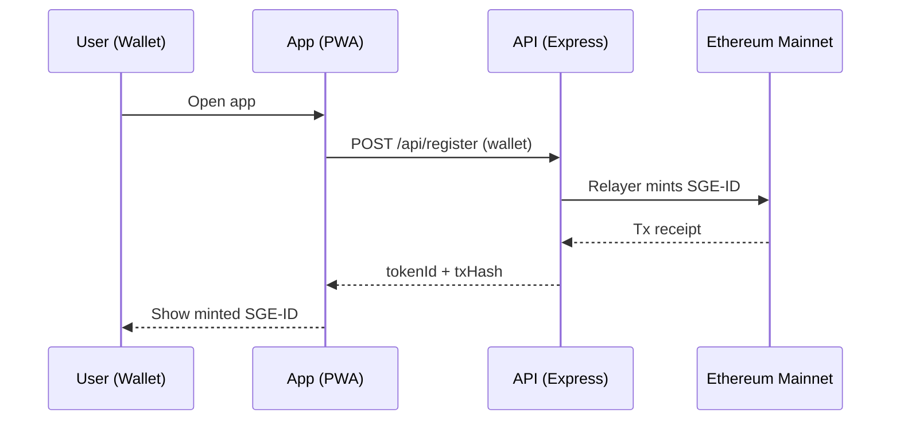

# Architecture Overview

## Components

- **PWA App** (`@sge/app`): Coinbase Wallet-first UX, approvals + claim UX.
- **API** (`@sge/api`): gasless minting, optional Commerce webhooks, storage.
- **Contracts** (`@sge/contracts`): SGE-ID ERC721; claim contract is external mainnet deployment.
- **Shared** (`@sge/shared`): ABIs and shared helpers.

## High-level flow

