# Multi-Tenant Settlement Platform Architecture

SGE is built as a **multi-tenant settlement platform** supporting multiple independent client programs with hierarchical affiliate networks and perfect settlement guarantees.

---

## System Overview


---

## Core Entities

### Programs (Multi-Tenant Isolation)

Each **Program** represents an independent client with:
- Unique treasury address for fund collection
- Custom fee configuration (registration fee, claim tiers)
- Dedicated affiliate network
- Isolated ledger for reconciliation
- API key for programmatic access

**Example:**
- Program A: "SuperGaming DAO" - $10 registration, 5% affiliate commissions
- Program B: "Energy Alliance" - $25 registration, 10% referral bonuses

### Affiliates (Hierarchical Tree)

Affiliates form a **tree structure** where:
- Each affiliate has a unique referral code
- Can refer both end-users and sub-affiliates
- Commission attribution flows UP the tree
- Tiered commission splits (direct, tier-2, tier-3)

**Tree Example:**
```
ALPHA (Parent)
├── BETA (Child of ALPHA)
│   ├── User1 → BETA earns 1%, ALPHA earns 0.5%
│   └── User2 → BETA earns 1%, ALPHA earns 0.5%
└── GAMMA (Child of ALPHA)
    └── User3 → GAMMA earns 1%, ALPHA earns 0.5%
```

### Intents (Idempotent Operations)

All user actions are **intents** with:
- Unique idempotency key (prevents duplicates)
- Status progression: PENDING → PROCESSING → CONFIRMED/FAILED
- Immutable audit trail
- Automatic retry on transient failures

**Intent Types:**
- **Registration**: Mint SGE-ID NFT to user wallet
- **Claim**: Transfer USDC/USDT from user to treasury

### Settlements (Blockchain Confirmations)

Each successful intent creates a **settlement**:
- Links to original intent (foreign key)
- Stores transaction hash for verification
- Tracks block number and timestamp
- Creates corresponding ledger entries

---

## Double-Entry Ledger

**Every financial transaction creates balanced ledger entries:**

| Event | Debit | Credit | Amount |
|-------|-------|--------|--------|
| User registers ($10) | User Wallet | Program Treasury | $10.00 |
| Affiliate commission | Program Treasury | Affiliate Wallet | $0.10 |
| User claims 100 SGE | User Wallet | Program Treasury | 100 SGE |

**Invariants:**
```typescript
// For each program, at all times:
assert(sumDebits(programId) === sumCredits(programId));

// For each affiliate:
assert(sumCommissions(affiliateId, 'ACCRUED') + 
       sumCommissions(affiliateId, 'PAYABLE') +
       sumCommissions(affiliateId, 'PAID') === 
       sumLedgerCredits(affiliateId));
```

**Reconciliation:**
Daily cron job verifies ledger balances and alerts on imbalances. See [ops/reconciliation.md](ops/reconciliation.html) for runbook.

---

## Settlement Pipeline

**Intent-Based Architecture** ensures idempotency and retry-safety:


**Key Properties:**
- **Idempotent**: Same intent submitted twice = same outcome
- **Atomic**: Either all ledger entries commit or none
- **Auditable**: Full history preserved (never delete)
- **Recoverable**: Failed intents can be manually retried via admin API

---

## Affiliate Commission Flow

```mermaid
sequenceDiagram
    participant User
    participant API
    participant DB
    participant Ledger

    User->>API: Register with ?ref=ALPHA
    API->>DB: Find affiliate "ALPHA"
    API->>DB: Create user (referredBy = ALPHA)
    
    Note over API,Ledger: Calculate commissions
    
    API->>DB: Commission: ALPHA = 1% × $10 = $0.10
    API->>Ledger: DEBIT Program Treasury $0.10
    API->>Ledger: CREDIT ALPHA Wallet $0.10
    
    alt ALPHA has parent BETA
        API->>DB: Commission: BETA = 0.5% × $10 = $0.05
        API->>Ledger: DEBIT Program Treasury $0.05
        API->>Ledger: CREDIT BETA Wallet $0.05
    end
    
    API->>API: Update commission status → ACCRUED
    API-->>User: Registration complete
```



**Payout Cycle:**
1. Daily job finds ACCRUED commissions > 30 days old
2. Updates status to PAYABLE
3. Creates payout batch (PENDING_APPROVAL)
4. Waits for 2-person approval
5. Executes batch payout (multi-send transaction)
6. Updates status to PAID

---

## Security Model

### Trust Boundaries


### Wallet Roles

| Wallet | Private Key Location | Purpose | Risk Level |
|--------|---------------------|---------|------------|
| **Deployer** | Offline (1Password) | One-time contract deployment | 🟡 Medium |
| **Relayer** | API server env vars | Gas sponsorship for user txs | 🔴 **High** |
| **Treasury** | Cold storage (Gnosis Safe) | Receives user payments | 🟢 Low |

**Key Management Best Practices:**
- Relayer balance kept < 0.5 ETH (limits exposure)
- Treasury uses multi-sig (2-of-3 or 3-of-5)
- Deployer key never stored on servers
- All keys rotated quarterly

### Attack Surface

| Vector | Mitigation |
|--------|-----------|
| Duplicate claims | Idempotency keys + unique constraint on (wallet, intentId) |
| Replay attacks | Webhook signature verification (HMAC-SHA256) |
| Sybil attacks | SGE-ID NFT (one per wallet) + optional KYC |
| Affiliate fraud | Commission approval workflow + manual review |
| Ledger manipulation | Database-level constraints + daily reconciliation |

---

## Observability

### Health Metrics (Exported to Prometheus)

- `sge_intents_total{status}` - Counter of intents by status
- `sge_settlement_duration_seconds` - Histogram of settlement latency
- `sge_ledger_balance` - Gauge of ledger balance per program
- `sge_queue_depth` - Gauge of pending jobs
- `sge_relayer_balance_eth` - Gauge of relayer wallet balance

### Dashboards

1. **Client Portal** (`/`) - Register, claim, view status
2. **Affiliate Portal** (`/affiliate`) - Track referrals, commissions, payouts
3. **Admin Portal** (`/admin`) - Manage programs, approve payouts
4. **Reconciliation Dashboard** (`/admin/reconciliation`) - Ledger health, stuck intents, queue status
5. **Status Page** (`/status`) - System health, contract addresses, live charts

### Tracing

Structured logging with correlation IDs:
```json
{
  "level": "info",
  "msg": "Intent processed",
  "intentId": "intent_123",
  "wallet": "0x...",
  "programId": "prog_A",
  "duration_ms": 1234,
  "tx_hash": "0x..."
}
```

---

## Scaling Considerations

### Horizontal Scaling

- **API Servers**: Stateless, scale with load balancer
- **Workers**: Add more worker processes (BullMQ handles distribution)
- **Database**: Read replicas for analytics, write primary for mutations

### Performance Targets

| Metric | Target | Current |
|--------|--------|---------|
| Settlement latency (p95) | < 5 seconds | ~2 seconds |
| API response time (p95) | < 200ms | ~80ms |
| Daily throughput | 100k intents | Tested to 50k |
| Queue depth (normal) | < 100 jobs | ~20 jobs |

### Cost Structure

| Component | Cost/Month (1k users) | Cost/Month (100k users) |
|-----------|----------------------|-------------------------|
| Relayer gas | ~0.1 ETH ($200) | ~10 ETH ($20,000) |
| Database (Postgres) | $25 | $500 |
| Redis (Queue) | $15 | $150 |
| RPC (Alchemy) | Free tier | $199/mo |
| **Total** | **~$240** | **~$20,850** |

**Cost Optimization:**
- Batch payouts to reduce gas costs
- Use EIP-1559 base fee + priority fee = 1 gwei
- Cache blockchain data to reduce RPC calls
- Implement graduated RPC tier based on volume

---

## Deployment Topology

### Local Mock (Development)

```
┌─────────────────┐
│ Browser         │
│ localhost:5173  │
└────────┬────────┘
         │
┌────────▼────────┐
│ Vite Dev Server │
└────────┬────────┘
         │
┌────────▼────────┐
│ Express API     │
│ localhost:3000  │
│ (Mock DB/Queue) │
└─────────────────┘
```

### Production (AWS/GCP/Azure)

```
┌─────────────┐
│ CloudFlare  │  ← CDN + DDoS protection
└──────┬──────┘
       │
┌──────▼──────┐
│ Load Balancer│
└──────┬──────┘
       │
   ┌───┴───┐
   │       │
┌──▼──┐ ┌──▼──┐
│ API │ │ API │  ← Stateless (2+ instances)
└──┬──┘ └──┬──┘
   │       │
   └───┬───┘
       │
   ┌───┴────────────┬─────────────┐
   │                │             │
┌──▼──────┐  ┌──────▼─────┐  ┌───▼────┐
│Postgres │  │   Redis    │  │Workers │
│(Primary)│  │  (Cluster) │  │(Pool)  │
└─────────┘  └────────────┘  └────────┘
```

**Infrastructure Requirements:**
- 2+ API servers (t3.medium or equivalent)
- 1 worker pool (t3.small, auto-scaling)
- PostgreSQL 14+ (db.t3.small → db.r5.large)
- Redis 7+ (cache.t3.micro → cache.r5.large)
- ALB or equivalent load balancer
- S3 or equivalent for backups

---

## For More Details

- **Data Model**: [data.md](data.html)
- **API Reference**: [enterprise.md](enterprise.html)
- **Operations Runbook**: [ops/reconciliation.md](../ops/reconciliation.html)
- **Workflow Diagrams**: [workflows.md](workflows.html)
- **Security Analysis**: [ops/threat-model.md](../ops/threat-model.html)
