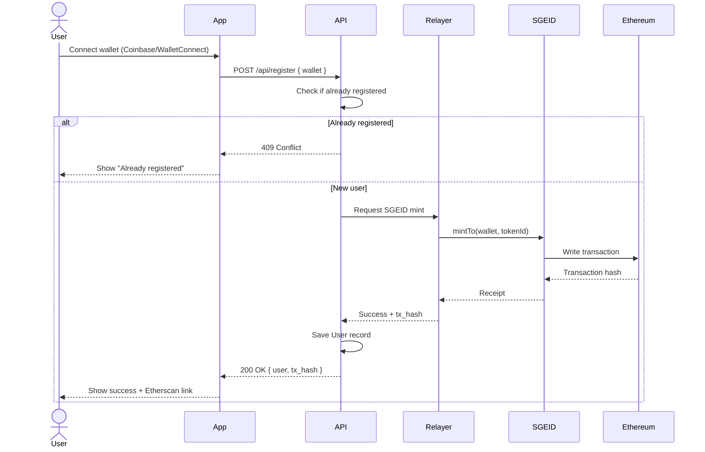
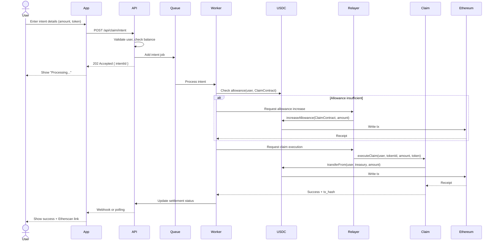
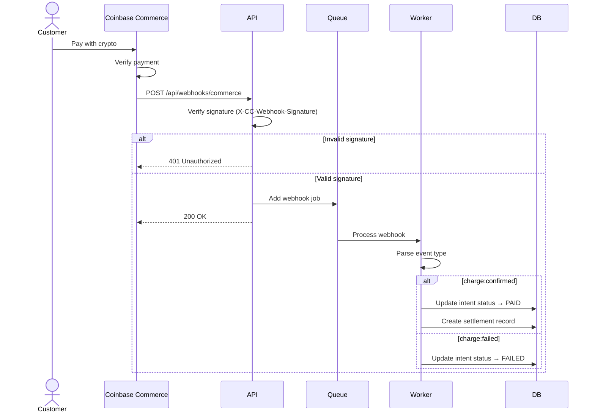
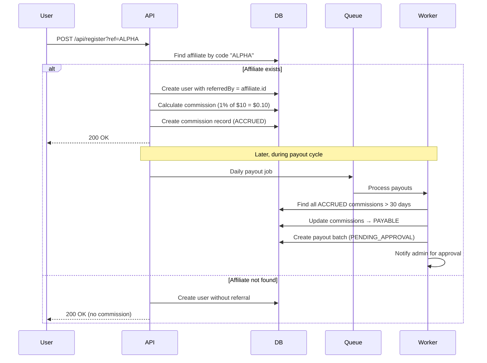

# System Workflows

Complete workflow diagrams showing how data flows through the SGE platform.

## Registration Flow



**Key Points:**
- **Idempotent**: Duplicate registrations return existing record
- **Relayer pattern**: API never holds hot wallet keys
- **Gas abstraction**: User pays nothing
- **Sequential tokenIds**: First user = 1, second = 2, etc.

---

## Claim Flow (Single-Signature)



**Key Points:**
- **Background processing**: Worker handles blockchain interactions
- **Allowance management**: Automatically resets if insufficient
- **Idempotency**: Each intent has unique ID
- **Treasury address**: Funds collected at program-level wallet

---

## Commerce Webhook Flow



**Key Points:**
- **Signature verification**: Uses shared secret from Coinbase
- **Async processing**: Webhook returns immediately, worker processes later
- **Event types**: `charge:created`, `charge:confirmed`, `charge:failed`, `charge:delayed`
- **Idempotency**: Webhook ID prevents duplicate processing

---

## Affiliate Commission Flow



**Key Points:**
- **Tiered attribution**: If ALPHA was referred by BETA, both earn
- **Approval workflow**: 2-person approval for payout batches
- **Commission rates**: Configurable in program settings
- **Minimum payout**: Default $10 (configurable)

---

## Security Boundaries

```mermaid
graph TB
    subgraph "Public Internet"
        User[User Browser]
        GitHub[GitHub Pages Demo]
    end

    subgraph "Application Layer"
        App[React App<br/>packages/app]
        API[Express API<br/>packages/api]
    end

    subgraph "Data Layer"
        DB[(PostgreSQL<br/>Prisma)]
        Redis[(Redis<br/>BullMQ)]
    end

    subgraph "Blockchain Layer"
        RPC[RPC Provider<br/>Infura/Alchemy]
        Ethereum[Ethereum Mainnet]
    end

    subgraph "Secrets Management"
        Relayer[Relayer Wallet<br/>Hot wallet]
        Treasury[Treasury Wallet<br/>Cold storage]
        Deployer[Deployer Wallet<br/>One-time use]
    end

    User -->|HTTPS| App
    GitHub -->|MSW| GitHub
    App -->|API calls| API
    API -->|Queries| DB
    API -->|Jobs| Redis
    API -->|RPC calls| RPC
    RPC -->|JSON-RPC| Ethereum
    
    API -.->|Signs txs| Relayer
    Ethereum -.->|Receives funds| Treasury
    
    style Relayer fill:#ff6b6b
    style Treasury fill:#51cf66
    style Deployer fill:#ffd43b
    style User fill:#4dabf7
