# System Architecture

## High-Level Overview

```mermaid
%%{init: {'theme':'base', 'themeVariables': { 'primaryColor':'#22c55e','primaryTextColor':'#f5f5f5','primaryBorderColor':'#16a34a','lineColor':'#3b82f6','secondaryColor':'#1a1a1a','tertiaryColor':'#0a0a0a','background':'#0a0a0a','mainBkg':'#1a1a1a','secondBkg':'#2a2a2a'}}}%%
graph TB
    subgraph Client["🌐 Client Layer"]
        PWA[React PWA<br/>Vite + wagmi]
        CW[Coinbase Wallet<br/>Browser Extension]
    end
    
    subgraph API["⚡ API Layer"]
        Express[Express Server<br/>TypeScript]
        Relayer[Relayer Wallet<br/>Gasless Tx]
    end
    
    subgraph Blockchain["⛓️ Ethereum Mainnet"]
        SGEID[SGEID Contract<br/>ERC-721]
        USDC[USDC Contract]
        USDT[USDT Contract]
        Claim[SGE Claim Contract]
    end
    
    subgraph External["🔌 External Services"]
        RPC[Ethereum RPC<br/>Alchemy/Infura]
        Commerce[Coinbase Commerce<br/>Optional]
    end
    
    PWA -->|1. Request Mint| Express
    Express -->|2. Relayer Signs| Relayer
    Relayer -->|3. Submit Tx| RPC
    RPC -->|4. Execute| SGEID
    
    PWA -->|5. Approve USDC/USDT| CW
    CW -->|6. User Signs| RPC
    RPC -->|7. Set Allowance| USDC
    RPC -->|7. Set Allowance| USDT
    
    PWA -->|8. Claim Tokens| Express
    Express -->|9. Prepare Claim| Claim
    PWA -->|10. Execute Claim| CW
    
    Express -.->|Optional Payment| Commerce
    Commerce -.->|Webhook| Express
    
    classDef client fill:#3b82f6,stroke:#2563eb,color:#fff
    classDef api fill:#22c55e,stroke:#16a34a,color:#000
    classDef chain fill:#f59e0b,stroke:#d97706,color:#000
    classDef external fill:#8b5cf6,stroke:#7c3aed,color:#fff
    
    class PWA,CW client
    class Express,Relayer api
    class SGEID,USDC,USDT,Claim chain
    class RPC,Commerce external
```

## Container Diagram (C4)

## Deployment Architecture

## Technology Stack

| Layer | Technologies |
|-------|-------------|
| **Frontend** | React, Vite, TypeScript, wagmi, Coinbase Wallet SDK |
| **Backend** | Express, TypeScript, ethers.js v6, Pino logger |
| **Contracts** | Solidity 0.8.23, Hardhat, OpenZeppelin |
| **Infrastructure** | Docker, PM2, GitHub Actions |
| **Blockchain** | Ethereum Mainnet, ERC-721, ERC-20 |
| **External** | Alchemy/Infura RPC, Coinbase Commerce (optional) |

## Security Boundaries

