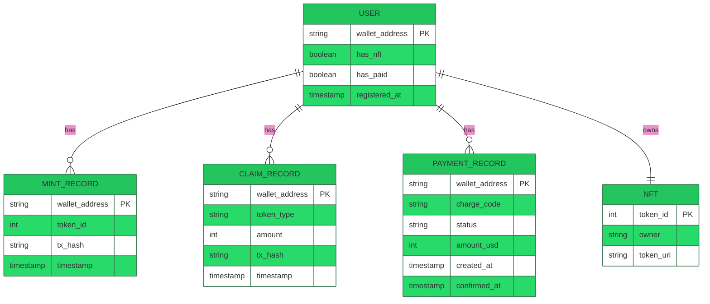
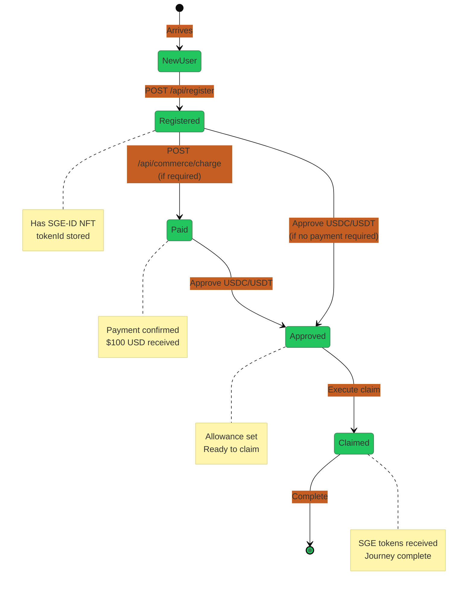
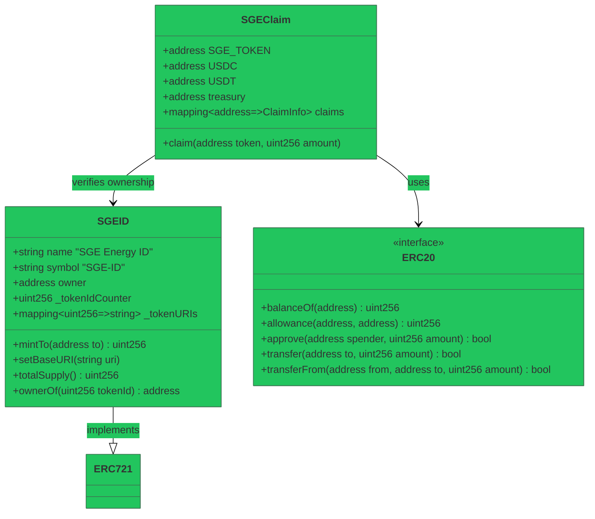
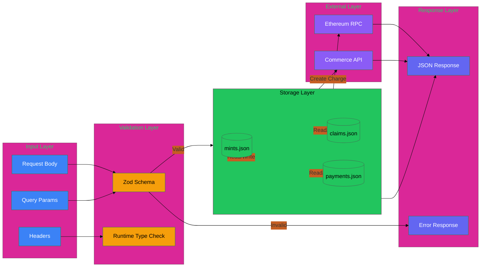
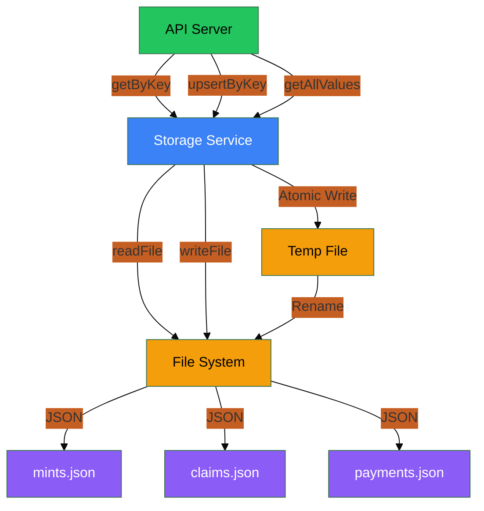

# Data Model

## Entity Relationship Diagram



## JSON Storage Schema

### mints.json
```json
{
  "0x742d35Cc6634C0532925a3b844Bc9e7595f0bEb": {
    "tokenId": 1,
    "txHash": "0xabc...",
    "timestamp": 1706553600000
  }
}
```

### claims.json
```json
{
  "0x742d35Cc6634C0532925a3b844Bc9e7595f0bEb": {
    "token": "USDC",
    "amount": 100000000,
    "approveTxHash": "0xdef...",
    "claimTxHash": "0x123...",
    "timestamp": 1706557200000
  }
}
```

### payments.json
```json
{
  "0x742d35Cc6634C0532925a3b844Bc9e7595f0bEb": {
    "chargeCode": "ABC123",
    "status": "CONFIRMED",
    "amountUsd": 100,
    "createdAt": 1706550000000,
    "confirmedAt": 1706553600000
  }
}
```

## State Machine: User Journey



## Contract State



## API Data Flow



## Token Economics

| Token | Type | Decimals | Mainnet Address |
|-------|------|----------|----------------|
| **SGE** | ERC-20 | 18 | `0x40489719E489782959486A04B765E1E93E5B221a` |
| **USDC** | ERC-20 | 6 | `0xA0b86991c6218b36c1d19D4a2e9Eb0cE3606eB48` |
| **USDT** | ERC-20 | 6 | `0xdAC17F958D2ee523a2206206994597C13D831ec7` |
| **SGE-ID** | ERC-721 | - | Deployed dynamically |

## Storage Patterns


