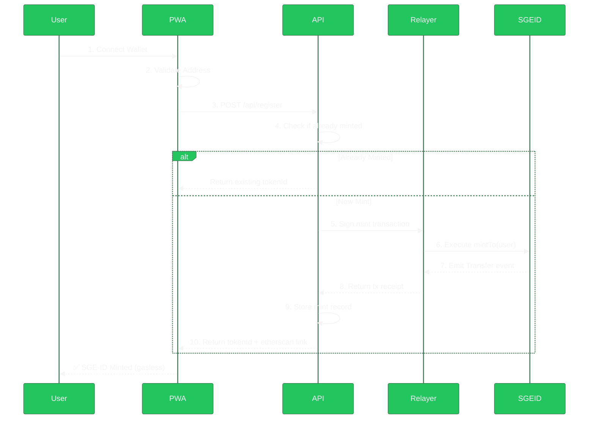
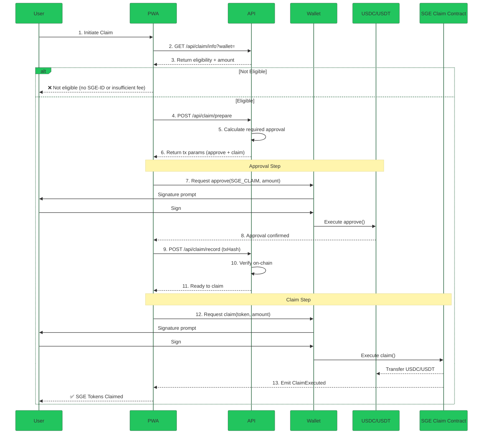
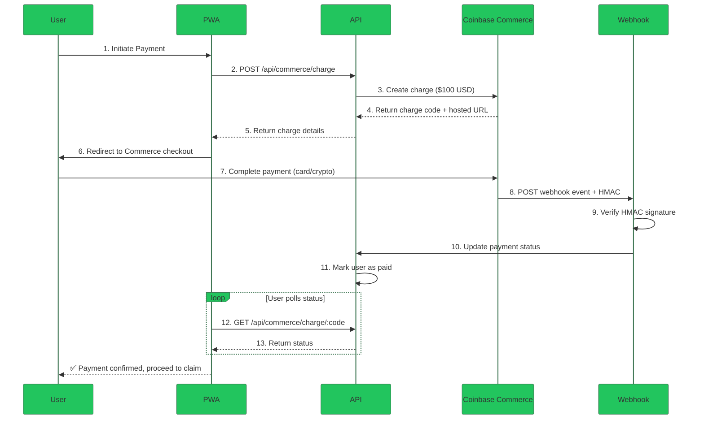
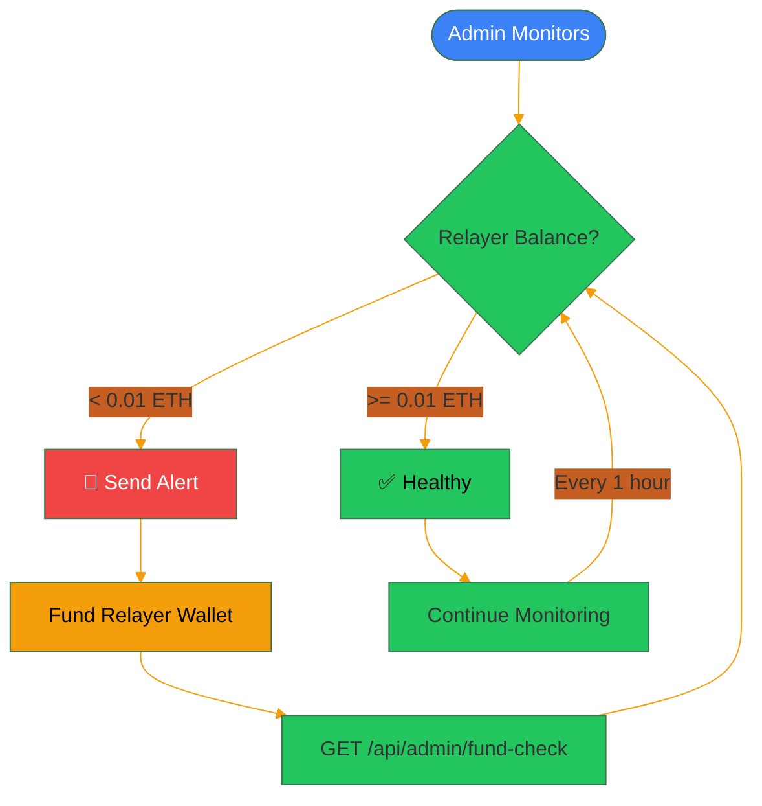
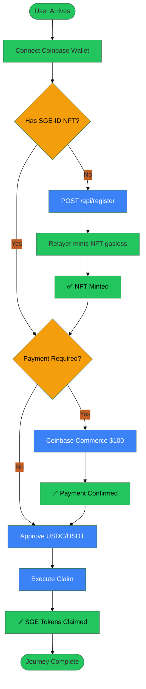

# System Flows

## Registration Flow (Gasless Mint)

```mermaid
%%{init: {'theme':'base', 'themeVariables': { 'primaryColor':'#22c55e','primaryTextColor':'#f5f5f5','lineColor':'#3b82f6'}}}%%
sequenceDiagram
    participant User
    participant PWA
    participant API
    participant Relayer
    participant SGEID
    
    User->>PWA: 1. Connect Wallet
    PWA->>PWA: 2. Validate Address
    PWA->>API: 3. POST /api/register
    API->>API: 4. Check if already minted
    
    alt Already Minted
        API-->>PWA: Return existing tokenId
    else New Mint
        API->>Relayer: 5. Sign mint transaction
        Relayer->>SGEID: 6. Execute mintTo(user)
        SGEID-->>Relayer: 7. Emit Transfer event
        Relayer-->>API: 8. Return tx receipt
        API->>API: 9. Store mint record
        API-->>PWA: 10. Return tokenId + etherscan link
    end
    
    PWA-->>User: ✅ SGE-ID Minted (gasless)
```

## Claim Flow (USDC/USDT → SGE)

```mermaid
%%{init: {'theme':'base', 'themeVariables': { 'primaryColor':'#22c55e','lineColor':'#3b82f6'}}}%%
sequenceDiagram
    participant User
    participant PWA
    participant API
    participant Wallet
    participant Token as USDC/USDT
    participant Claim as SGE Claim Contract
    
    User->>PWA: 1. Initiate Claim
    PWA->>API: 2. GET /api/claim/info?wallet=
    API-->>PWA: 3. Return eligibility + amount
    
    alt Not Eligible
        PWA-->>User: ❌ Not eligible (no SGE-ID or insufficient fee)
    else Eligible
        PWA->>API: 4. POST /api/claim/prepare
        API->>API: 5. Calculate required approval
        API-->>PWA: 6. Return tx params (approve + claim)
        
        Note over PWA,Token: Approval Step
        PWA->>Wallet: 7. Request approve(SGE_CLAIM, amount)
        Wallet->>User: Signature prompt
        User->>Wallet: Sign
        Wallet->>Token: Execute approve()
        Token-->>PWA: 8. Approval confirmed
        
        PWA->>API: 9. POST /api/claim/record (txHash)
        API->>API: 10. Verify on-chain
        API-->>PWA: 11. Ready to claim
        
        Note over PWA,Claim: Claim Step
        PWA->>Wallet: 12. Request claim(token, amount)
        Wallet->>User: Signature prompt
        User->>Wallet: Sign
        Wallet->>Claim: Execute claim()
        Claim-->>Token: Transfer USDC/USDT
        Claim-->>PWA: 13. Emit ClaimExecuted
        
        PWA-->>User: ✅ SGE Tokens Claimed
    end
```

## Commerce Payment Flow (Optional)

```mermaid
%%{init: {'theme':'base', 'themeVariables': { 'primaryColor':'#22c55e','lineColor':'#8b5cf6'}}}%%
sequenceDiagram
    participant User
    participant PWA
    participant API
    participant Commerce as Coinbase Commerce
    participant Webhook
    
    User->>PWA: 1. Initiate Payment
    PWA->>API: 2. POST /api/commerce/charge
    API->>Commerce: 3. Create charge ($100 USD)
    Commerce-->>API: 4. Return charge code + hosted URL
    API-->>PWA: 5. Return charge details
    
    PWA->>User: 6. Redirect to Commerce checkout
    User->>Commerce: 7. Complete payment (card/crypto)
    
    Commerce->>Webhook: 8. POST webhook event + HMAC
    Webhook->>Webhook: 9. Verify HMAC signature
    Webhook->>API: 10. Update payment status
    API->>API: 11. Mark user as paid
    
    loop User polls status
        PWA->>API: 12. GET /api/commerce/charge/:code
        API-->>PWA: 13. Return status
    end
    
    PWA-->>User: ✅ Payment confirmed, proceed to claim
```

## Admin Funding Check

```mermaid
%%{init: {'theme':'base', 'themeVariables': { 'primaryColor':'#22c55e','lineColor':'#f59e0b'}}}%%
flowchart TD
    Start([Admin Monitors]) --> Check{Relayer Balance?}
    Check -->|< 0.01 ETH| Alert[🚨 Send Alert]
    Check -->|>= 0.01 ETH| OK[✅ Healthy]
    
    Alert --> Fund[Fund Relayer Wallet]
    Fund --> Verify[GET /api/admin/fund-check]
    Verify --> Check
    
    OK --> Monitor[Continue Monitoring]
    Monitor -->|Every 1 hour| Check
    
    style Start fill:#3b82f6,color:#fff
    style Alert fill:#ef4444,color:#fff
    style OK fill:#22c55e,color:#000
    style Fund fill:#f59e0b,color:#000
```

## Complete User Journey

```mermaid
%%{init: {'theme':'base', 'themeVariables': { 'primaryColor':'#22c55e'}}}%%
graph TD
    Start([User Arrives]) --> Connect[Connect Coinbase Wallet]
    Connect --> HasNFT{Has SGE-ID NFT?}
    
    HasNFT -->|No| Register[POST /api/register]
    Register --> Mint[Relayer mints NFT gasless]
    Mint --> NFTDone[✅ NFT Minted]
    
    HasNFT -->|Yes| CheckPay{Payment Required?}
    NFTDone --> CheckPay
    
    CheckPay -->|Yes| Pay[Coinbase Commerce $100]
    Pay --> PayDone[✅ Payment Confirmed]
    
    CheckPay -->|No| Approve
    PayDone --> Approve[Approve USDC/USDT]
    
    Approve --> Claim[Execute Claim]
    Claim --> Success[✅ SGE Tokens Claimed]
    
    Success --> End([Journey Complete])
    
    classDef success fill:#22c55e,color:#000
    classDef action fill:#3b82f6,color:#fff
    classDef decision fill:#f59e0b,color:#000
    
    class NFTDone,PayDone,Success success
    class Register,Pay,Approve,Claim action
    class HasNFT,CheckPay decision
```
