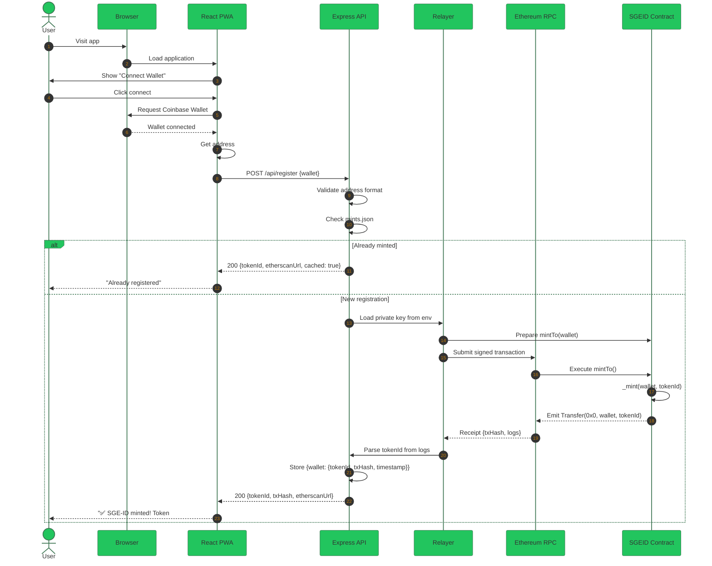
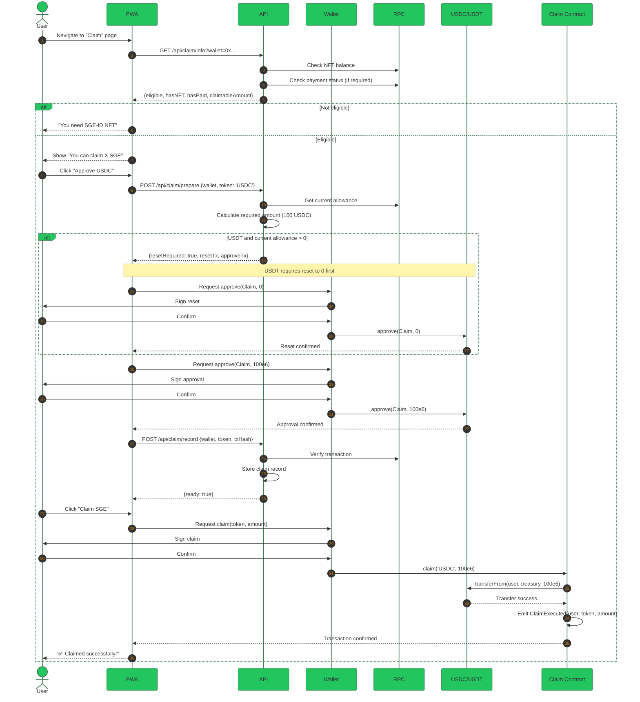
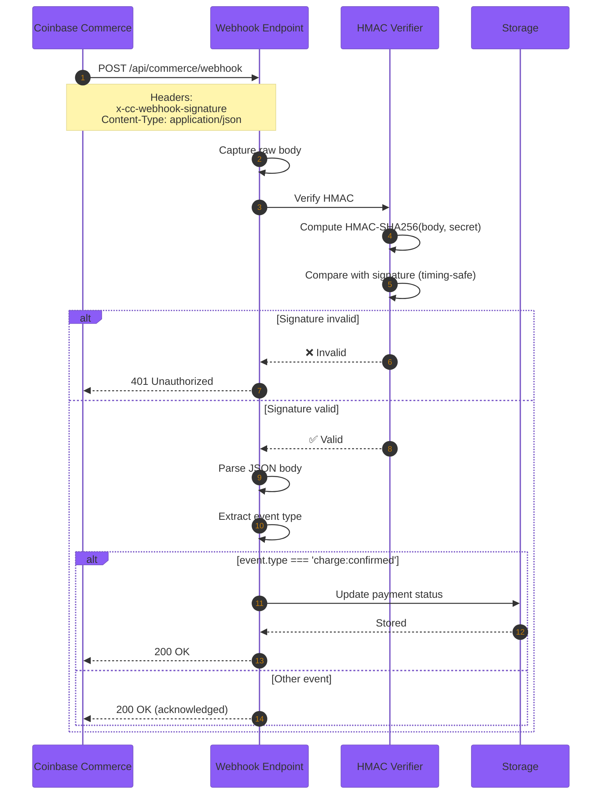
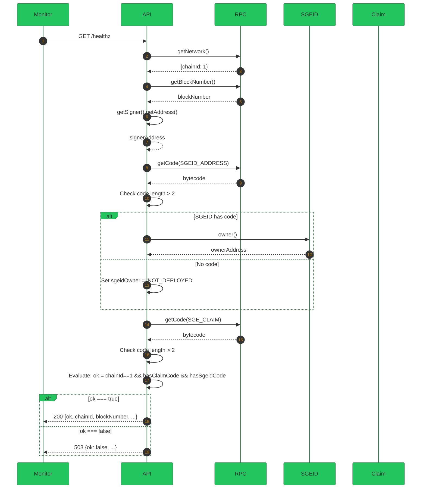

# Sequence Diagrams

## Detailed Registration Sequence

```mermaid
%%{init: {'theme':'base', 'themeVariables': { 'primaryColor':'#22c55e','lineColor':'#3b82f6'}}}%%
sequenceDiagram
    autonumber
    actor User
    participant Browser
    participant PWA as React PWA
    participant API as Express API
    participant Relayer
    participant RPC as Ethereum RPC
    participant SGEID as SGEID Contract
    
    User->>Browser: Visit app
    Browser->>PWA: Load application
    PWA->>User: Show "Connect Wallet"
    
    User->>PWA: Click connect
    PWA->>Browser: Request Coinbase Wallet
    Browser-->>PWA: Wallet connected
    PWA->>PWA: Get address
    
    PWA->>API: POST /api/register {wallet}
    API->>API: Validate address format
    API->>API: Check mints.json
    
    alt Already minted
        API-->>PWA: 200 {tokenId, etherscanUrl, cached: true}
        PWA-->>User: "Already registered"
    else New registration
        API->>Relayer: Load private key from env
        Relayer->>SGEID: Prepare mintTo(wallet)
        Relayer->>RPC: Submit signed transaction
        RPC->>SGEID: Execute mintTo()
        SGEID->>SGEID: _mint(wallet, tokenId)
        SGEID-->>RPC: Emit Transfer(0x0, wallet, tokenId)
        RPC-->>Relayer: Receipt {txHash, logs}
        Relayer->>API: Parse tokenId from logs
        API->>API: Store {wallet: {tokenId, txHash, timestamp}}
        API-->>PWA: 200 {tokenId, txHash, etherscanUrl}
        PWA-->>User: "✅ SGE-ID minted! Token #123"
    end
```

## Detailed Claim Sequence

```mermaid
%%{init: {'theme':'base', 'themeVariables': { 'primaryColor':'#22c55e','lineColor':'#3b82f6'}}}%%
sequenceDiagram
    autonumber
    actor User
    participant PWA
    participant API
    participant Wallet
    participant RPC
    participant Token as USDC/USDT
    participant Claim as Claim Contract
    
    User->>PWA: Navigate to "Claim" page
    PWA->>API: GET /api/claim/info?wallet=0x...
    API->>RPC: Check NFT balance
    API->>RPC: Check payment status (if required)
    API-->>PWA: {eligible, hasNFT, hasPaid, claimableAmount}
    
    alt Not eligible
        PWA-->>User: "You need SGE-ID NFT"
    else Eligible
        PWA-->>User: Show "You can claim X SGE"
        User->>PWA: Click "Approve USDC"
        
        PWA->>API: POST /api/claim/prepare {wallet, token: 'USDC'}
        API->>RPC: Get current allowance
        API->>API: Calculate required amount (100 USDC)
        
        alt USDT and current allowance > 0
            API-->>PWA: {resetRequired: true, resetTx, approveTx}
            Note over PWA,Token: USDT requires reset to 0 first
            PWA->>Wallet: Request approve(Claim, 0)
            Wallet->>User: Sign reset
            User->>Wallet: Confirm
            Wallet->>Token: approve(Claim, 0)
            Token-->>PWA: Reset confirmed
        end
        
        PWA->>Wallet: Request approve(Claim, 100e6)
        Wallet->>User: Sign approval
        User->>Wallet: Confirm
        Wallet->>Token: approve(Claim, 100e6)
        Token-->>PWA: Approval confirmed
        
        PWA->>API: POST /api/claim/record {wallet, token, txHash}
        API->>RPC: Verify transaction
        API->>API: Store claim record
        API-->>PWA: {ready: true}
        
        User->>PWA: Click "Claim SGE"
        PWA->>Wallet: Request claim(token, amount)
        Wallet->>User: Sign claim
        User->>Wallet: Confirm
        Wallet->>Claim: claim('USDC', 100e6)
        Claim->>Token: transferFrom(user, treasury, 100e6)
        Token-->>Claim: Transfer success
        Claim->>Claim: Emit ClaimExecuted(user, token, amount)
        Claim-->>PWA: Transaction confirmed
        
        PWA-->>User: "✅ Claimed successfully!"
    end
```

## Webhook Verification Sequence

```mermaid
%%{init: {'theme':'base', 'themeVariables': { 'primaryColor':'#8b5cf6','lineColor':'#3b82f6'}}}%%
sequenceDiagram
    autonumber
    participant Commerce as Coinbase Commerce
    participant API as Webhook Endpoint
    participant Verifier as HMAC Verifier
    participant Storage
    
    Commerce->>API: POST /api/commerce/webhook
    Note over Commerce,API: Headers:<br/>x-cc-webhook-signature<br/>Content-Type: application/json
    
    API->>API: Capture raw body
    API->>Verifier: Verify HMAC
    Verifier->>Verifier: Compute HMAC-SHA256(body, secret)
    Verifier->>Verifier: Compare with signature (timing-safe)
    
    alt Signature invalid
        Verifier-->>API: ❌ Invalid
        API-->>Commerce: 401 Unauthorized
    else Signature valid
        Verifier-->>API: ✅ Valid
        API->>API: Parse JSON body
        API->>API: Extract event type
        
        alt event.type === 'charge:confirmed'
            API->>Storage: Update payment status
            Storage-->>API: Stored
            API-->>Commerce: 200 OK
        else Other event
            API-->>Commerce: 200 OK (acknowledged)
        end
    end
```

## Health Check Sequence

```mermaid
%%{init: {'theme':'base', 'themeVariables': { 'primaryColor':'#22c55e','lineColor':'#3b82f6'}}}%%
sequenceDiagram
    autonumber
    participant Monitor
    participant API
    participant RPC
    participant SGEID
    participant Claim
    
    Monitor->>API: GET /healthz
    API->>RPC: getNetwork()
    RPC-->>API: {chainId: 1}
    
    API->>RPC: getBlockNumber()
    RPC-->>API: blockNumber
    
    API->>API: getSigner().getAddress()
    API-->>API: signerAddress
    
    API->>RPC: getCode(SGEID_ADDRESS)
    RPC-->>API: bytecode
    API->>API: Check code length > 2
    
    alt SGEID has code
        API->>SGEID: owner()
        SGEID-->>API: ownerAddress
    else No code
        API->>API: Set sgeidOwner = 'NOT_DEPLOYED'
    end
    
    API->>RPC: getCode(SGE_CLAIM)
    RPC-->>API: bytecode
    API->>API: Check code length > 2
    
    API->>API: Evaluate: ok = chainId==1 && hasClaimCode && hasSgeidCode
    
    alt ok === true
        API-->>Monitor: 200 {ok, chainId, blockNumber, ...}
    else ok === false
        API-->>Monitor: 503 {ok: false, ...}
    end
```
