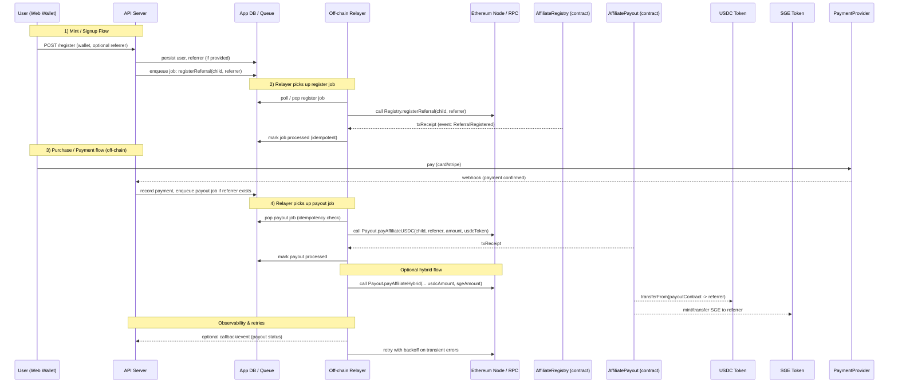

## SR-level Sequence: Affiliate Instant Liquidity (Mermaid)

```mermaid
sequenceDiagram
  participant User as User (Web Wallet)
  participant API as API Server
  participant DB as App DB / Queue
  participant Relayer as Off-chain Relayer
  participant Node as Ethereum Node / RPC
  participant Registry as AffiliateRegistry (contract)
  participant Payout as AffiliatePayout (contract)
  participant USDC as USDC Token
  participant SGE as SGE Token

  Note over User,API: 1) Mint / Signup Flow
  User->>API: POST /register (wallet, optional referrer)
  API->>DB: persist user, referrer (if provided)
  API->>DB: enqueue job: registerReferral(child, referrer)

  Note over DB,Relayer: 2) Relayer picks up register job
  Relayer->>DB: poll / pop register job
  Relayer->>Node: call Registry.registerReferral(child, referrer)
  Registry-->>Relayer: txReceipt (event: ReferralRegistered)
  Relayer->>DB: mark job processed (idempotent)

  Note over User,API: 3) Purchase / Payment flow (off-chain)
  User->>PaymentProvider: pay (card/stripe)
  PaymentProvider-->>API: webhook (payment confirmed)
  API->>DB: record payment, enqueue payout job if referrer exists

  Note over DB,Relayer: 4) Relayer picks up payout job
  Relayer->>DB: pop payout job (idempotency check)
  Relayer->>Node: call Payout.payAffiliateUSDC(child, referrer, amount, usdcToken)
  Payout-->>Relayer: txReceipt
  Relayer->>DB: mark payout processed

  Note over Relayer,Node: Optional hybrid flow
  Relayer->>Node: call Payout.payAffiliateHybrid(... usdcAmount, sgeAmount)
  Payout-->>USDC: transferFrom(payoutContract -> referrer)
  Payout-->>SGE: mint/transfer SGE to referrer

  Note over API,Relayer: Observability & retries
  Relayer-->>API: optional callback/event (payout status)
  Relayer->>Node: retry with backoff on transient errors
```

Rendering: paste this file into a Mermaid-capable viewer (VS Code Mermaid Preview, GitLab, or mermaid.live).
