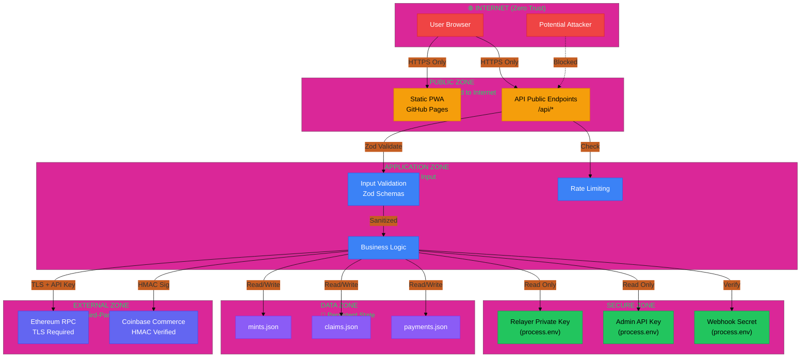
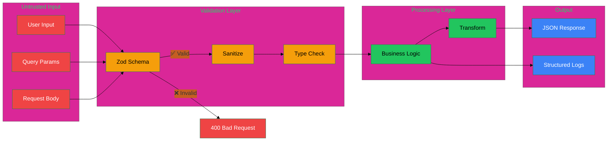
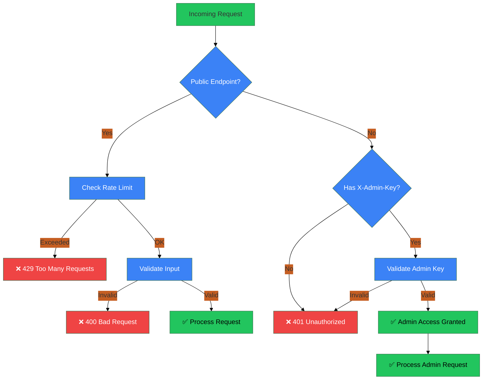
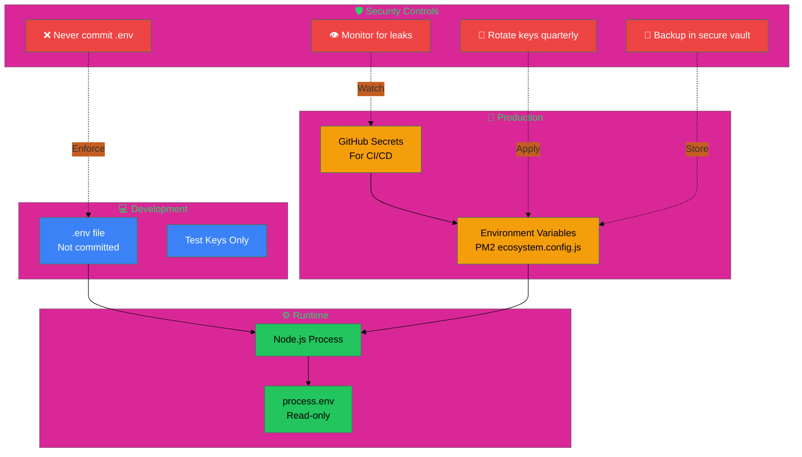

# Trust Boundaries & Security Zones

## Trust Boundary Map

## Data Flow Security

## Authentication & Authorization

## Secrets Management

## Threat Model Summary

| Threat | Mitigation | Status |
|--------|-----------|--------|
| **Private key leak** | Never commit, env vars only, rotate quarterly | ✅ Implemented |
| **Admin key brute force** | Long random key, rate limiting, monitoring | ✅ Implemented |
| **Webhook replay** | HMAC signature verification (timing-safe) | ✅ Implemented |
| **SQL injection** | No SQL (JSON storage), Zod validation | ✅ N/A |
| **XSS** | React auto-escapes, no dangerouslySetInnerHTML | ✅ Implemented |
| **CSRF** | Public endpoints, no cookies, explicit origin | ✅ Implemented |
| **Rate limiting bypass** | IP-based, exponential backoff | ⚠️ Basic only |
| **Relayer wallet drain** | Low balance alerts, monitoring | ✅ Implemented |
| **USDT allowance exploit** | Reset to 0 before increase | ✅ Implemented |
| **Frontend manipulation** | All critical ops signed by user | ✅ Implemented |

## Security Checklist

- [ ] All secrets in environment variables (never committed)
- [ ] HTTPS enforced for all endpoints
- [ ] Input validation with Zod schemas
- [ ] Rate limiting on public endpoints
- [ ] Admin endpoints require X-Admin-Key header
- [ ] Webhook signatures verified with timing-safe comparison
- [ ] Relayer wallet balance monitoring
- [ ] Structured logging (no PII in logs)
- [ ] Error messages don't leak system details
- [ ] Dependencies scanned regularly (Dependabot)
