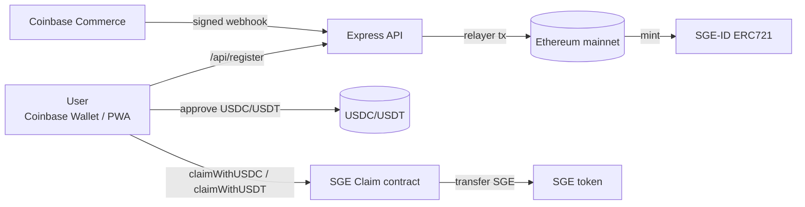

  
Mainnet <strong>chainId = 1</strong> Hard guardrails to avoid testnet drift.

  
Payments <strong>USDC/USDT</strong> Allowance checks + USDT reset-to-zero.

  
Ops <strong>Runbooks</strong> Monitoring + incident checklist.

## System map

